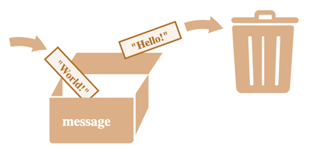

Переменную можно представить как коробку, в который кладутся данные.

Надпись на коробке — это название переменной, с которой нам как пользователю удобно работать.  
А сама коробка, это реализация переменных внутри Python.

В переменную можно что-то положить, можно посмотреть, что в ней лежит.  
А можно просто заменить содержимое переменной.
