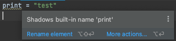

# Как нежелательно называть переменные

**[Встроенные функции](https://docs.python.org/3/library/functions.html#built-in-functions)** 

Их использовать в качестве переменных можно, но не желательно.  
Такими действиями вы перезапишите стандартное поведение встроенных функций  
и не сможете пользоваться ими до конца выполнения текущей программы.  

После перезапуска программы, они будут доступны снова до того момента,  
пока они не будут перезаписаны.  

```python
print = "test"  # ошибки нет, но есть предупреждение
```

