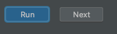

# Задание без проверки
Первый тип заданий — это задания без проверки.  

Задания без проверки включают в себя кнопку "Run" для запуска задания.  
Такие задания считаются автоматически верными.

1. Нажмите Run, чтобы запустить задание.
2. Нажмите Next, чтобы перейти к следующему заданию.
