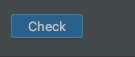

# Задание с проверкой по распечанной информации
Второй тип заданий - это задания с проверкой по распечанной информации. 

Задания с проверкой по распечанной информации включают в себя кнопку "Check" для запуска задания.  

Задания такого типа должны содержать в себе команду `print()`,  
которая будет печатать результат выполнения вашего задания.  
Результат должен в точности совпадать с ожидаемым результатом.  

Если ответ совпадает, то увидете зеленую запись Correct.
