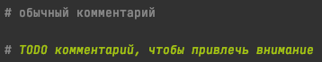
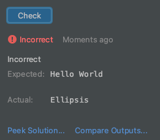

Если задание выполнено неверно, то будет красная запись Incorrect.

Те места, которые нужно выполнить в задании, выделены особыми комментариями, начинающимися с TODO.  
Это особенность среды разработки PyCharm, чтобы такие комментарии привлекали внимание.

Если задание решено неверно, то нажав на надпись **Compare Outputs**, 
можно сравнить ваше решение и ответ, который от вас ждут

1. Запустить первоначальный вариант задания.
2. Нажать **Compare Outputs**, чтобы сравнить ответы
3. Исправить код, чтобы задание было выполнено верно
