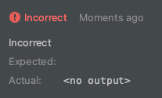
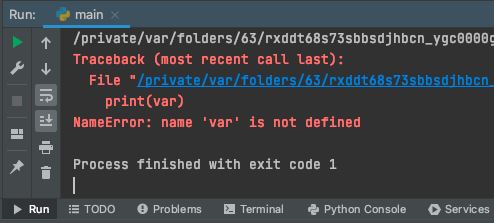

Иногда при запуске задания, можно увидеть фразу: ```<no output>```.


Появляется она в двух случаях:
1. Не вызвана команда `print`, чтобы распечатать результат
2. В написанной программе находится ошибка, и интерпретатор не смог выполнить код.

В текущем задании допущена ошибка, а именно необъявленна переменная `var`. Исправьте эту ошибку.
1. Запустите проверку задания. 
1. Затем откройте вкладку Run в левом нижнем углу, чтобы увидеть результат вашей программы. 
1. Исправить ошибку, чтобы задание было выполнено верно.
