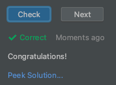

Вне зависимости от результата проверки задания, можно получить решение.  
Для того, чтобы посмотреть решение задания, необходимо нажать на надпись **Peek Solution** 

Старайтесь не жульничать, и подглядывать в решение только в случае если вы решили задание и хотите посмотреть вариант решения.  
Или вы застряли на задании и не знаете, как его решать :( может решение натолкнет вас на нужную мысль.

1. Распечатать два слова Hello и World на отдельных строках.
1. Проверить задание.
1. Нажать на надпись **Peek Solution**, чтобы посмотреть решение.
